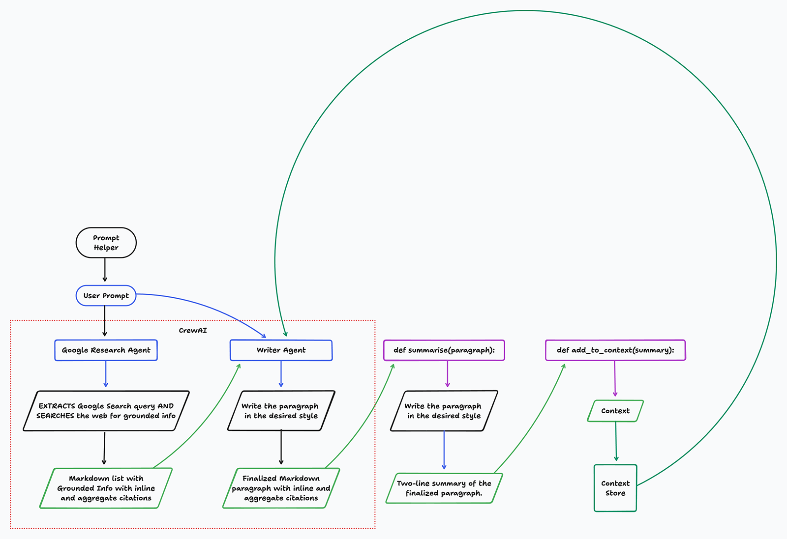

<p align="center">
  
</p>

<p align="center">
	<h1 align="center"><b>Openplexity Pages</b></h1>
<p align="center">
    Open-Source Perplexity Pages
    <br />
    <br />
    <a href="https://x.com/alxfazio">@alxfazio</a>
    ·
    <a href="https://x.com/mutatedmindcom">@mutatedmindcom</a>
    ·
    <a href="https://x.com/breezeight">@breezeight</a>
  </p>
</p>

---

## Introducing OpenPlexity Pages

OpenPlexity Pages serves as an open-source alternative to Perplexity Pages, with the aim of transforming your research into visually appealing, comprehensive content.
Although the system is not capable of producing publication-ready articles, which often necessitate a substantial number of revisions, experienced editors may find it beneficial during their initial writing phase.

## What sets OpenPlexity apart?

- **Open Source**: Unlike Perplexity Pages, OpenPlexity Pages is fully open source, allowing for community contributions and customizations.
- **Privacy-Focused**: Your data stays with you. OpenPlexity Pages runs locally, ensuring your research and content remain private.
- **Customizable**: Tailor the tone of your content to resonate with your target audience, from general readers to subject matter experts.
- **Adaptable**: Easily modify the structure of your articles—add, rearrange, or remove sections to best suit your material.
- **Visual**: Enhance your articles with AI-generated visuals or integrate your own images.

## Features That Matter

- **Local LLM Support (Coming soon!)**: Harness the power of Llama3 and Mixtral using Ollama for content generation.
- **Seamless Creation**: Transform your research into well-structured, beautifully formatted articles with ease.
- **Always Current**: Unlike static embedding-based tools, OpenPlexity Pages uses real-time search results, ensuring your content is up-to-date.

## A Tool for Everyone

OpenPlexity Pages empowers creators in any field to share knowledge:

- **Educators**: Develop comprehensive study guides, breaking down complex topics into digestible content.
- **Researchers**: Create detailed reports on your findings, making your work more accessible.
- **Hobbyists**: Share your passions by creating engaging guides that inspire others.
- **Content Creators**: Produce well-researched, visually appealing articles on any topic.

# Requirements
- `Groq API Key`,
- `Seperapi API Key`.

# Getting Started

Follow these instructions to set up and run OpenPlexity Pages using Poetry.

## Installation

First, ensure you have Poetry installed. If not, install it via pip:

```bash
pip install poetry
```

Once Poetry is installed, navigate to your project directory and install the dependencies:

```bash
poetry install
```

## Configuration

Next, you need to create a `.env` file in the root directory of the project. This file will store your `pplx_api` key. Use the following command to create and add your API key to the `.env` file:

```bash
$ echo "GROQ_API_KEY=<your-groq-api-key>
BASE_URL=https://rentry.co
SERPER_API_KEY=<your-serper-api-key>" > .env
```

## Running the Application

To run the application, use the following command:

```bash
poetry run streamlit run openplexity_pages/app.py
```

And that's it! Your application should now be up and running. Enjoy exploring OpenPlexity Pages!

---

## Architecture

<p align="center">
  
</p>

## Contribute

OpenPlexity Pages thrives on community contributions. Whether you're fixing bugs, adding features, or improving docs, we welcome your input! Check out our [CONTRIBUTING.md](CONTRIBUTING.md) for guidelines.

## Support the Project

Love OpenPlexity Pages? Here's how you can help:

- Star us on GitHub

## The Power of Open Source

While Perplexity Pages offers a polished, hosted solution, OpenPlexity Pages brings the power of AI-driven content creation to the open-source community. We believe in the potential of collaborative development and the importance of data privacy.

With OpenPlexity Pages, you have the freedom to host your own instance, contribute to its development, and create content that educates, inspires, and engages your audience—all while maintaining full control over your data and the tool itself.

**Let's see what we can create together.**

## Roadmap
- [ ] Make better
- [ ] Fix image feature
- [ ] Add more document export modalities
- [ ] Local LLM support
- [ ] Settings for LLMs

## Acknowledgement
We are very grateful to [MutatedMind](https://mutatedmind.com) for leading the UI development.

## License

[MIT](https://opensource.org/licenses/MIT)

Copyright (c) 2024-present, Alex Fazio

---

[](https://x.com/alxfazio/status/1816167602265157672)
